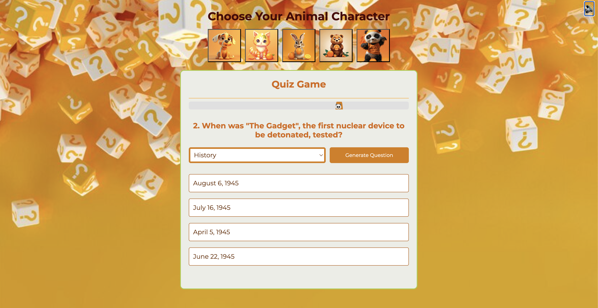

# Quiz Game Documentation 🎮



[Quiz Game](https://liliyalexx.github.io/quiz_Game/)

Welcome to the **Quiz Game** project! This is a fun and interactive quiz application that uses AI to generate questions based on user-selected topics. The game includes a timer, character selection for the time, background music, and sound effects to enhance the user experience.

---

## Table of Contents
1. [Project Overview](#project-overview)
2. [Features](#features)
3. [Tools and Technologies](#tools-and-technologies)
4. [File Structure](#file-structure)
5. [Setup Instructions](#setup-instructions)
6. [How to Play](#how-to-play)
7. [API Integration](#api-integration)

---

## Project Overview

The Quiz Game is a web-based application that allows users to:
- Select a topic for the quiz.
- Choose a character to represent them during the game.
- Answer AI-generated multiple-choice questions.
- Track their score and progress with a timer and sound effects.

The application is built using **HTML**, **CSS**, **JavaScript**, and **Node.js** for the backend. It integrates with the **OpenAI API** to generate quiz questions dynamically.

---

## Features

### 1. **Topic Selection**
   - Users can input a topic (e.g., "AI", "History", "Science").
   - The application maps the topic to a category and fetches relevant questions.

### 2. **Character Selection**
   - Users can choose a character (e.g., 🐶, 🐱) to represent timer during the quiz.

### 3. **AI-Generated Questions**
   - Questions are generated dynamically using the **OpenAI API**.
   - Each question includes 4 options with one correct answer and 2 options with true or false answers.

### 4. **Timer**
   - A 20-second timer is displayed for each question.
   - If the user doesn't answer in time, the question is marked as incorrect.

### 5. **Sound Effects**
   - Correct answers trigger a "ding" sound.
   - Incorrect answers or timeouts trigger a "wrong" sound.

### 6. **Score Tracking**
   - The user's score is displayed at the end of the quiz.

### 7. **Responsive Design**
   - The application is designed to work on both desktop and mobile devices.

---

## Tools and Technologies

### Frontend
- **HTML**: Structure of the web pages.
- **CSS**: Styling and animations (e.g., timer bar, button hover effects).
- **JavaScript**: Logic for handling user interactions, fetching questions, and managing the quiz flow.

### Backend
- **Node.js**: Server-side runtime environment.
- **Express.js**: Framework for building the backend API.
- **Axios**: HTTP client for making API requests.

### APIs
- **OpenAI API**: Used to generate quiz questions dynamically.

### Other Tools
- **Dotenv**: For managing environment variables (e.g., API keys).
- **Cors**: For enabling cross-origin resource sharing.

---

## File Structure
| File/Folder          | Description                                                                 |
|----------------------|-----------------------------------------------------------------------------|
| **css/**             | Contains styles for the application.                                        |
| ├── style.css        | Main CSS file for styling the quiz interface.                               |
| └── background-image.jpg | Background image for the quiz.                                          |
| **fonts/**           | Contains custom fonts (if any).                                             |
| **images/**          | Contains images for characters and icons.                                   |
| **js/**              | Contains JavaScript logic for the quiz.                                     |
| └── app.js           | Main JavaScript file for handling quiz logic and interactions.              |
| **sounds/**          | Contains sound effects for correct/wrong answers.                           |
| **index.html**       | Main HTML file for the quiz interface.                                      |
| **server.js**        | Backend server logic for handling API requests and generating questions.    |
| **package.json**     | Project dependencies and scripts.                                           |
| **.env**             | Environment variables (e.g., API keys).                                     |
| **README.md**        | Project documentation.                                                      |
| **.gitignore**       | Specifies files and folders to ignore in Git.                               |


---

## Setup Instructions

### Prerequisites
- **Node.js** installed on your machine.
- An **OpenAI API key** (sign up at [OpenAI](https://openai.com/)).

### Steps
1. **Clone the Repository**
   ```bash
   git clone https://github.com/liliyaLexx/quiz-Game.git
   cd quiz_Game

   npm install
   npm start


## How to Play
### 1. **Choose a Character**
   - Click on a character (e.g., 🐶, 🐱) to represent you during the quiz.

### 2. **Select a Topic**
   - Enter a topic (e.g., "AI", "History") in the input field and click **"Generate Questions"**.


### 3. **Start the Quiz**
   - Click **"Start Quiz"** to begin.

### 4. **Answer Questions**
   - Read the question and select the correct answer within **20 seconds**.

### 5. **View Your Score**
   - At the end of the quiz, your score will be displayed.

---

## API Integration

The application integrates with the **OpenAI API** to generate quiz questions. The backend (`server.js`) sends a request to the API with the user's selected topic and receives a JSON response containing the question, options, and correct answer.

### Example API Request:
```json
{
  "model": "gpt-3.5-turbo",
  "messages": [
    {
      "role": "user",
      "content": "Generate a multiple-choice question about AI with 4 options and indicate the correct answer."
    }
  ]
}